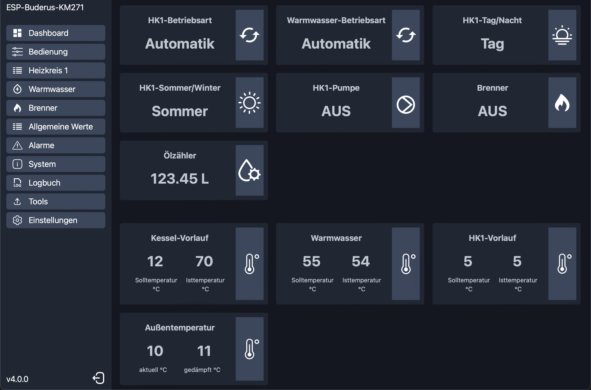
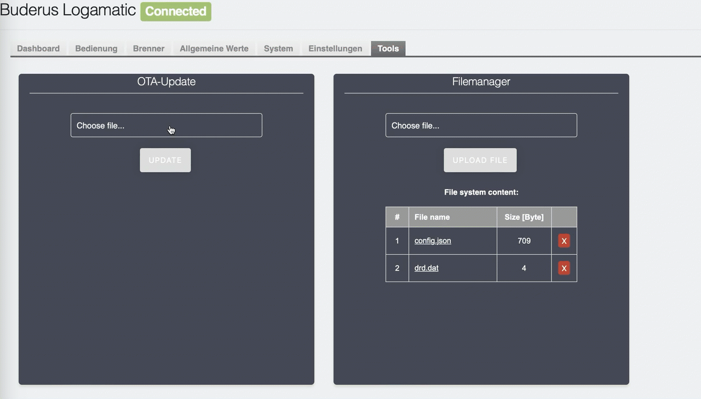
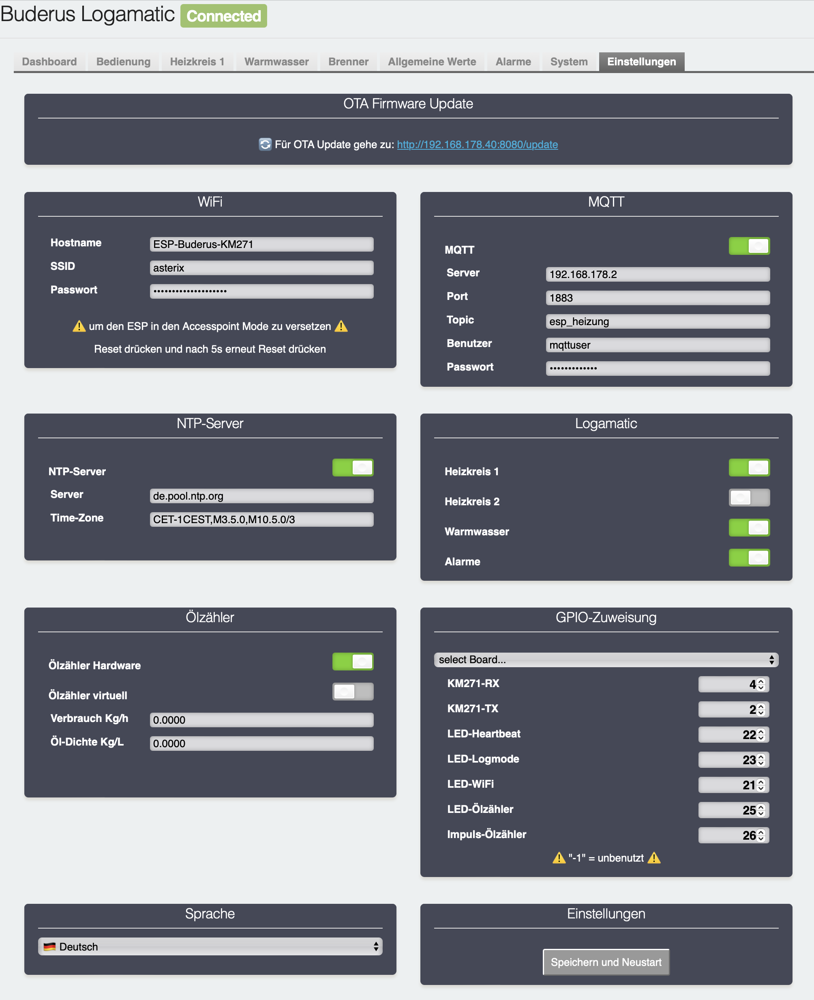

-----

[](https://github.com/dewenni/ESP_Buderus_KM271/releases/latest)


[](https://github.com/dewenni/ESP_Buderus_KM271/stargazers/)

-----

If you like this, please push the ```Star ⭐️``` and click on ```watch 👁``` to stay tuned

-----

Control your Buderus Logamatic R2107 / HS 2105 with ESP and MQTT

The information from the heater provides a better understanding of how the heater works and offers opportunities for optimization.

In combination with influxDB and Grafana you can also create useful and impressive Dashboard of your heating system.

But there is also a build in WebUI to view and control your Logamatic without any other Software.



-----

# Table of Contents

- [Overview](#overview)
- [Hardware](#hardware)
  - [Option 1 - Board from the78mole](#option-1---board-from-the78mole)
  - [Option 2 - ESP32 with original Buderus KM271](#option-2---esp32-with-original-buderus-km271)
  - [Optional: Hardware Oilmeter](#optional-hardware-oilmeter)
- [Getting started](#getting-started)
  - [Platform-IO](#platform-io)
  - [ESP-Flash-Tool](#esp-flash-tool)
  - [OTA-Updates](#ota-updates)
  - [Setup-Mode](#setup-mode)
  - [Configuration](#configuration)
  - [Filemanager](#filemanager)
- [MQTT](#mqtt)
  - [Config and Status values](#config-and-status-values)
  - [Commands](#commands)
- [Optional Components](#optional-components)
  - [node-red](#node-red)
  - [grafana](#grafana)

-----

# Overview

The heart of the project is the reverse engineered Buderus interface, that is based on the 3964R Protocol.  
The main code is based on the work of **Michael Mayer** who has set a really good base for the communication.
It has been extended with the possibility not only to read values, but also to write some common values to the Logamatic.

The software has multi language support and there is already german, and english texts available. It is also possible to add more languages.

Feel free to add more languages. The texts are located in: **[language.h](include/language.h)**

## additional and optional Oilcounter / Oilmeter

The project includes also an additional and optional oilcounter implementation. I have installed a Braun HZ-5 Meter to measure the oil consumption.  
There are different models with (HZ 5R, HZ 5DR) and without pulse output (HZ 5).  
I have used the normal one without pulse output and modified it with a small reed contact - that works fine and was simple to install.
If you are not interested in the Oil Meter function you can simple disable it in config.h

-----

# Hardware

## Option 1 - Board from the78mole

the easiest, smartest and even cheapest option is the DIY Interface that was build by Daniel Glaser. Big thanks for his engagement in this Topic!  
You can find more information here: <https://github.com/the78mole/km271-wifi>  
You can order it here: <https://www.tindie.com/products/24664/>  

In this case you only need this DIY interface and nothing more.
It includes the RS232/TTL Adapter and also an ESP32.  


(this is my board with the customized connector for the oil meter instead of the "USER 1" button)

## Option 2 - ESP32 with original Buderus KM271

The other option is, to use the original Buderus KM271 Module that has a serial interface (RS232).
In combination with a RS232 TTL Adapter (MAX3232) it can be connected to the TX/RX Port of the ESP.

Logamatic R2107 => KM271 => RS232/TTL Adapter => ESP

Example configuration:

```text
(ESP32)GPIO17/TXD2  -> (MAX3232)TXD -> (serial cable) -> (KM271-SUBD)PIN2:RXD
(ESP32)GPIO16/RXD2 <- (MAX3232)RXD <- (serial cable) <- (KM271-SUBD)PIN3:TXD
(ESP32)GND <-> (MAX3232)GND <-> (serial cable) <-> (KM271-SUBD)PIN5:GND
```


## Optional: Hardware Oilmeter

The software is also prepared to connect an Oil Meter. A well-known manufacturer of oil meters is Braun with the models HZ-5 or HZ6.
These are already available with a potential-free contact.  
I have used one without potential-free contact and have subsequently attached a reed contact. This was also very simple and works very reliably.


> ℹ️ **INFO:**  
> but this is only optional and can be used additionally to the Information´s that the software will read from the Logamatic.

-----

# Getting started

## Platform-IO

The software is created with [Visual Studio Code](https://code.visualstudio.com) and the [PlatformIO-Plugin](https://platformio.org).  
After installing the software you can clone the project from GitHub or you can download it as zip and open it in PlatformIO.
Then adapt the `upload_port` and corresponding settings in `platformio.ini` to your USB-to-serial Adapter and upload the code to the ESP.

## ESP-Flash-Tool

In the releases, you can find also the binary of the Software. If you don´t want to use PlatformIO, you can also use the `buderus_km271_esp32_flash_vx.x.x.bin` file and flash it directly on the ESP. This bin-file is already a merge with bootloader.bin, partitions.bin and the application.bin. You can flash this image an the ESP at address 0x00.  

**Windows**  
There are several tools available to flash binaries to the ESP.  
One of them is [espressif-flash-download-tool](https://www.espressif.com/en/support/download/other-tools)

**macOS/Linux**  
for Mac it is hard to find a tool with a graphical UI, but you can simple use the esptool.py:

1. open Terminal
2. install esptool: `pip install esptool`  
3. optional get the install path: `which esptool.py`  
4. set path: `export PATH="$PATH:/<path>/esptool.py"` (<- change <path> with result from 3.)
5. goto path where the bin file is located
6. get Device String: `ls /dev/tty* | grep usb` (use this in next Step for <UPLOAD-PORT>)
7. upload: `esptool.py -p <UPLOAD-PORT> write_flash 0x00 buderus_km271_esp32_flash_vx.x.x.bin`  

## OTA-Updates

since software version 3.0, you can also update the software with the new Elegant OTA web upload.  
You can find the update function in the "Tools" Tab of the WebUI.

here you can choose "Firmware" and select the `buderus_km271_ota_update_vx.x.x.bin` file from the release section



But it is also possible to download the software wireless with platformio. Therefore there is a new file `platformio_upload.py` that you dont have to change.  
You only have to change the `upload_port` settings in `platformio.ini`

There are 3 predefined Options:

- OPTION 1: direct cable upload
- OPTION 2: wireless OTA Update AsyncElegantOTA (use this from 3.0 to 3.2.3)
- OPTION 3: wireless OTA Update embedded (use this from 3.2.4)

## Setup Mode

There is a new "Setup Mode" available. The "Setup Mode" is activated, when you press the "reset-button" of the ESP. Press reset and after 5 seconds, press reset again.
The "Setup Mode" will also activated if there is no wifi connection configured.

If the ESP goes into "Setup Mode", it will automatically create a own network access point with ssid  
📶 `"ESP-Buderus-KM271"`  
After you are connected to this network, you can open the webUI on ip-address  
**"http://192.168.4.1"**

## Configuration

Here you can setup all the configuration that fits to your heating system and your infrastructure.

- **WiFi**  
enter your WiFi credentials to connect the ESP to your network

- **MQTT**  
here you can activate the MQTT communication and enter mandatory parameters
All the parameters are mandatory!

- **NTP Server**  
the ESP can connect to a NTP server to get the right Time information.
The default Time-Zone should fit if you are located in germany. Otherwise you can change it manually

- **Logamatic**  
here you can select, which components of your Logamatic should be used.

- **Oilmeter**  
here you can enable the optional hardware or virtual oilmeter.
If you use a hardware based oilmeter, you have to configure also to regarding gpio´s.
If you want to calculate the consumption based on the runtime, you have to configure the additional calculation parameters.

- **GPIO**  
Here you can configure the GPIO of your ESP-Board. You can use the options in the dropdown to get default values depending of the selected type of board.

- **Language**  
There are two languages available. Choose what you prefer.
The language take effect on the webUI and also on the mqtt messages!

- **Safe and Restart**  
All settings are only applied after a restart



## Filemanager

there is also a buildin file manager to download (export), upload (imoort) and delete files.
The configuration is stored in the ```config.json``` file. To backup and restore the configuration you can download and upload this file.

The drd.dat is an internal file to store information for the "double-reset-detection". Do not delete this one.


-----

# MQTT

## Config and Status values

The Software handles different kind of values:

### config values (read only)

this are config values from the Logamatic. The values are read at startup or if you change them at the Logamatic. The payload of the values are integer or float.

Config values as single topics (see list in [param.txt](Doc/param.txt))

```text
example:
Topic: esp_heizung/config/frost_protection_threshold
Payload:   -1.00 °C     (String)
```

### status values (read only)

this values will mostly change during runtime and will automatically send if changed. The payload of the values is a String.

Status values as single topics (see list in [param.txt](Doc/param.txt))

```text
example:
Topic: esp_heizung/status/hc1_ov1_automatic
Payload:   1    (integer)
```

### additional information's (read only)

status information about WiFi:

```text
Topic: esp_heizung/wifi = {  
    "status":"online",  
    "rssi":"-50",  
    "signal":"90",  
    "ip":"192.168.1.1",  
    "date-time":"01.01.2022 - 10:20:30"  
}
```

debug information:

```text
Topic: esp_heizung/info = {  
    "logmode":true,
    "send_cmd_busy":false,
    "date-time":"01.01.2022 - 10:20:30"  
}
```

### alarm messages (read only)

here you get the information about the last 4 Errors/Faults that are registered by the Logamatic. The payload of the values is a String.

>ℹ️ **Note:**  
>A complete List of supported values can be found in the **[param.txt](Doc/param.txt)**

you can also change the mqtt topics for your needs by editing: **[language.h](include/language.h)**

## Commands

To change the values of your Logamatic, you can use several `setvalue` commands from the list below.
A complete Topic could be `esp_heizung/setvalue/setdatetime`

**You can control the Logamatic with commands like this:**

```text
command:    restart ESP
topic:      {cmd/restart", cmd/restart"}
payload:    none

command:    Service interface - only for Experts - use at your own risk!!!
topic:      {cmd/service", cmd/service"}
payload:    8 hex values separated with "_" (example: 08_15_04_65_65_65_65_65)

command:    set date & time of Logamatic
topic:      {"setvalue/setdatetime", setvalue/setdatetime"}
payload:    none

command:    set oilcounter to given value
topic:      {"setvalue/oilcounter", setvalue/oilcounter"}
payload:    counter value including decimals (123,45L = 1234) 

command:    heating circuit 1: operation mode 
topic:      {"setvalue/hk1_betriebsart", setvalue/hc1_opmode"}
payload:    0=night / 1=day / 2=auto  

command:    heating circuit 1: program
topic:      {"setvalue/hk1_programm", setvalue/hc1_program"}
payload:    (0=custom / 1=family / 2=early / 3=late / 4=AM / 5=PM / 6=noon / 7=single / 8=senior)

command:    heating circuit 1: design temperature for heating curves
topic:      {"setvalue/hk1_auslegung", setvalue/hc1_interpretation"}
payload:    Resolution: 1 [°C] - Range: 30 ... 90 [°C]

command:    heating circuit 1: switch off threshold for reduction mode
topic:      {"setvalue/hk1_aussenhalt_ab", setvalue/hc1_switch_off_threshold"}
payload:    Resolution: 1 [°C] - Range: -20 ... +10 [°C]

command:    heating circuit 1: day temperature ww_setpoint
topic:      {"setvalue/hk1_tag_soll", setvalue/hc1_day_setpoint"}
payload:    Resolution: 0.5 [°C] - Range: 10 .. 30 [°C] 

command:    heating circuit 1: nigth temperature ww_setpoint
topic:      {"setvalue/hk1_nacht_soll", setvalue/hc1_night_setpoint"}
payload:    Resolution: 0.5 [°C] - Range: 10 .. 30 [°C] 

command:    heating circuit 1: nigth temperature ww_setpoint
topic:      {"setvalue/hk1_ferien_soll", setvalue/hc1_holiday_setpoint"}
payload:    Resolution: 0.5 [°C] - Range: 10 .. 30 [°C] 

command:    warm water: operation mode
topic:      {"setvalue/ww_betriebsart", setvalue/ww_opmode"}
payload:    0=night / 1=day / 2=auto

command:    heating circuit 1: summer mode threshold Temperature
topic:      {"setvalue/hk1_sommer_ab", setvalue/hc1_summer_mode_threshold"}
payload:    Resolution: 1 [°C] - Range: 9:Summer | 10°..30° | 31:Winter

command:    heating circuit 1: frost mode threshold Temperature
topic:      {"setvalue/hk1_frost_ab", setvalue/hc1_frost_mode_threshold"}
payload:    Resolution: 1 [°C] - Range: -20 ... +10 [°C]

command:    warm water: setpoint temperature
topic:      {"setvalue/ww_soll", setvalue/ww_setpoint"}
payload:    Resolution: 1 [°C] - Range: 30 ... 60 [°C]

command:    heating circuit 1: count of days for holiday mode (Logamatic will decrement every day by one)
topic:      {"setvalue/hk1_ferien_tage", setvalue/hc1_holidays"}
payload:    count of days 0 .. 99

command:    warm water pump cycles
topic:      {"setvalue/ww_pumpen_zyklus", setvalue/ww_pump_cycles"}
payload:    Resolution: 1 [cycles/hour] - Range: 0:OFF | 1..6 | 7:ON

```

-----

# Optional Components

## node-red

I´m writing all information's that are transmitted over MQTT into a influxDB Database.  
In my case I'm using [node-red](https://nodered.org/) to receive the MQTT messages and to write it into the [influxDB](https://www.influxdata.com/m).  
Everything runs in Docker on my Synology NAS.  
But there are a lot of other possibilities - use the one that fits you best.


If you are interested in my flows, you can use this export file:
[node-red.json](/Doc/node-red.json)

## grafana

To visualize the information's, I'm using [grafana](https://grafana.com) that gets the data out of the influxDB.  
For me this gets me more possibilities to analyze the behavior of the heating system compared to a static dashboard.  

Here are some impressions of what I did with all the information's that comes out of the Logamatic:


If you are interested my dashboard, you can use this export file:
[grafana.json](/Doc/grafana.json)

-----

# ❗️ use at own risk ❗️

**feel free to use and adopt to your needs!**

**If you have something to improve, let us all know about you ideas!**

❓ If you have a question, use the Discussions => <https://github.com/dewenni/ESP_Buderus_KM271/discussions>  
🐞 If there is a issue or bug, use the Issues => <https://github.com/dewenni/ESP_Buderus_KM271/issues>  
