<div align="center">
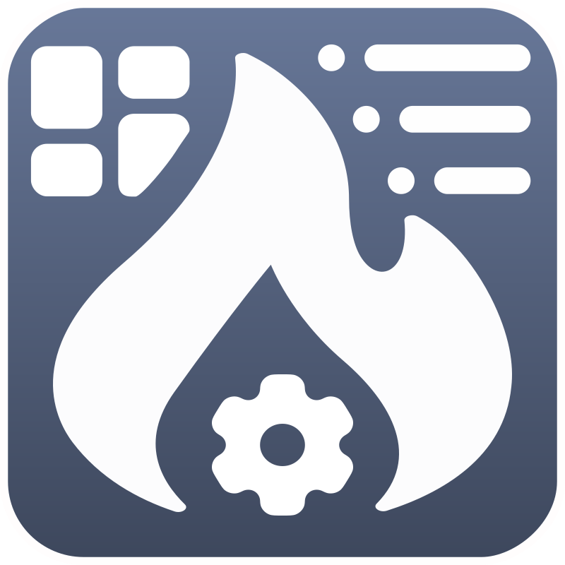 

<h3 style="text-align: center;">ESP-Buderus-KM271</h3>
</div>

-----

**[🇬🇧  english version of this description](README.md)**

-----

<div align="center">

[](https://github.com/dewenni/ESP_Buderus_KM271/releases/latest)


[](https://github.com/dewenni/ESP_Buderus_KM271/stargazers/)

[](https://github.com/dewenni/ESP_Buderus_KM271/stargazers/)

</div>

-----

<div align="center">
Wenn dir dieses Projekt gefällt, drücke genre auf den <b>[Stern ⭐️]</b> Button and drücke <b>[Watch 👁]</b> um auf dem Laufenden zu bleiben.
<br><br>
Und wenn du meine Arbeit unterstützen möchtest, kannst auch folgendes nutzen <p>

[](https://github.com/sponsors/dewenni)


</div>

-----

Steuere deine Buderus Logamatic R2107 / HS 2105 mit ESP32 und MQTT

Die Informationen aus der Heizung ermöglichen ein besseres Verständnis der Funktionsweise der Heizung und bieten Möglichkeiten zur Optimierung.

In Kombination mit influxDB und Grafana können auch nützliche und beeindruckende Dashboards der Heizungsanlage erstellt werden.

Es gibt aber auch eine eingebaute WebUI, mit der du deine Logamatic ohne weitere Software betrachten und steuern können.


(Desktop Version)

Die WebUI ist responsiv und bietet auch ein mobiles Layout.

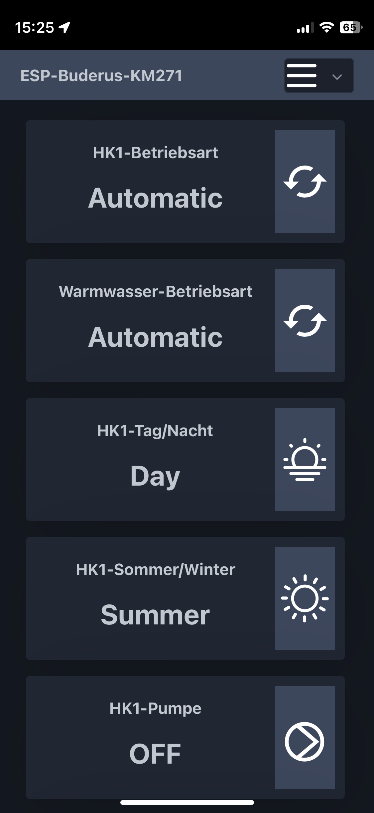 
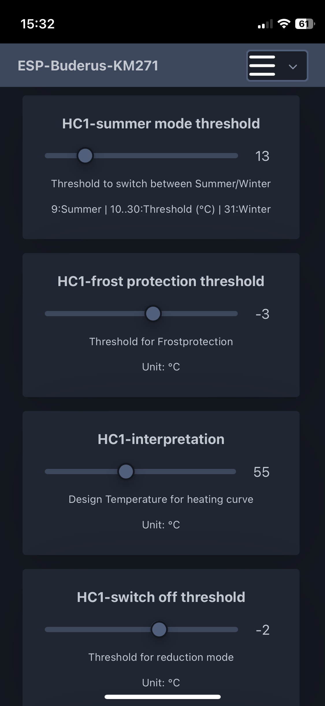 
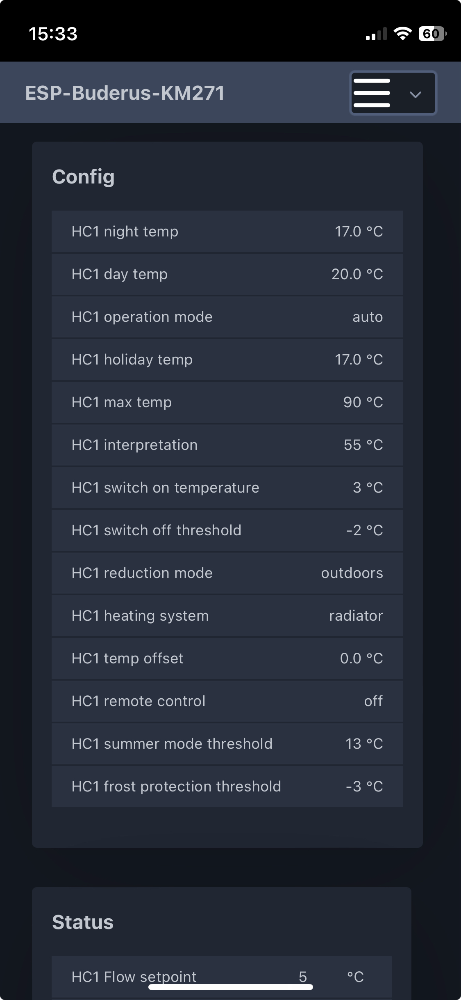   
(Mobile Version)

Um sich einen ersten Eindruck von den Funktionen und der WebUI zu verschaffen, steht auch eine eingeschränkte Demo zur Verfügung.
Diese kann über den folgenden Link aufgerufen werden: [WebUI-DEMO](https://dewenni.github.io/ESP_Buderus_KM271/)

-----

# Inhaltsverzeichnis

- [Überblick](#überblick)

- [Hardware](#hardware)
  - [Option 1 - Board von the78mole](#option-1---board-von-the78mole)
  - [Option 2 - ESP32 mit original Buderus KM271](#option-2---esp32-mit-original-buderus-km271)
  - [Optional: Hardware Ölzähler](#optional-hardware-ölzähler)
  - [Optional: OneWire Sensor](#optional-onewire-sensor)
  - [Optional: Abgas Sensor](#optional-abgas-sensor)
  - [Optional: Ethernet Modul W5500](#optional-ethernet-modul-w5500)

- [Erste Schritte](#erste-schritte)
  - [Platform-IO](#platform-io)
  - [ESP-Flash-Tool](#esp-flash-tool)
  - [OTA-Updates](#ota-updates)
  - [Setup-Mode](#setup-mode)
  - [Konfiguration](#konfiguration)
  - [Filemanager](#filemanager)

- [MQTT](#mqtt)
  - [Config and Status Werte](#config-and-status-values)
  - [Kommandos](#commands)
  - [Home Assistant](#home-assistant)

- [Optional Messaging](#optional-messaging)
  - [Pushover](#pushover)
  - [WebUI-Logger](#webui-logger)
  - [Telnet](#telnet)

- [Optionale Komponenten](#optionale-komponenten)
  - [node-red](#node-red)
  - [grafana](#grafana)

- [FAQ](#faq)

-----

# Überblick

Das Herzstück des Projekts ist die nachgebaute Buderus-Schnittstelle, die auf dem 3964R-Protokoll basiert.  
Der Hauptcode basiert auf der Arbeit von **Michael Mayer**, der eine wirklich gute Basis für die Kommunikation geschaffen hat.
Es wurde um die Möglichkeit erweitert, nicht nur Werte zu lesen, sondern auch einige allgemeine Werte in die Logamatic zu schreiben.

Die Software ist mehrsprachig und es sind bereits deutsche und englische Texte verfügbar. Es ist auch möglich, weitere Sprachen hinzuzufügen.


Du kannst gerne weitere Sprachen hinzufügen. Die Texte befinden sich in: **[language.h](include/language.h)** and **[lang.js](web/js/lang.js)**

## zusätzlicher und optionaler Ölzähler / Oil Meter

Das Projekt beinhaltet auch eine zusätzliche und optionale Ölzähler Implementierung. Ich habe einen Braun HZ-5 Ölzähler installiert, um den Ölverbrauch zu messen.  
Es gibt verschiedene Modelle mit (HZ 5R, HZ 5DR) und ohne Impulsausgang (HZ 5).  
Ich habe das normale Modell ohne Impulsausgang verwendet und es mit einem kleinen Reedkontakt modifiziert - das funktioniert es gut und war einfach zu installieren.

-----

# Hardware

## Option 1 - Board von the78mole

die einfachste, eleganteste und auch günstigste Variante ist das DIY Interface, das von Daniel Glaser gebaut wurde. Vielen Dank für dein Engagement in diesem Thema!  
Weitere Informationen findest du hier: <https://github.com/the78mole/km271-wifi>  
Bestellen kann man es hier: <https://www.tindie.com/products/24664/>  

In diesem Fall brauchst du nur dieses DIY-Interface und nichts weiter.
Es beinhaltet den RS232/TTL Adapter und auch einen ESP32. 


## Option 2 - ESP32 mit original Buderus KM271

Die andere Möglichkeit ist die Verwendung des original Buderus KM271-Moduls, das über eine serielle Schnittstelle (RS232) verfügt.
In Kombination mit einem RS232-TTL-Adapter (MAX3232) kann es an den TX/RX-Port des ESP angeschlossen werden.

Logamatic R2107 => KM271 => RS232/TTL Adapter => ESP

Example configuration:

```text
(ESP32)GPIO17/TXD2  -> (MAX3232)TXD -> (serialles Kabel) -> (KM271-SUBD)PIN2:RXD
(ESP32)GPIO16/RXD2 <- (MAX3232)RXD <- (serialles Kabel) <- (KM271-SUBD)PIN3:TXD
(ESP32)GND <-> (MAX3232)GND <-> (serialles Kabel) <-> (KM271-SUBD)PIN5:GND
```


## Optional: Ethernet Modul W5500

### Option 1 - einzelnes W5500 Modul

Es ist auch möglich, ein W5500 Ethernet Modul an das Board oder einen generischen ESP32 anzuschließen. Bei den KM271-Boards von Daniel kann das W5500 an dem J7-Anschluss des Boards angeschlossen werden.

> [!IMPORTANT]
> Das Anschlusskabel sollte so kurz wie möglich sein (ca. 10 cm).

Board >= 0.0.6

| Signal | GPIO          | Pin (J7) |
|--------|---------------|----------|
| VCC    |               | J7.2     |
| GND    |               | J7.10    |
| CLK    |  18           | J7.9     |
| MOSI   |  23           | J7.7     |
| MISO   |  19           | J7.5     |
| CS     |  15           | J7.3     |
| INT    |  14           | J7.8     |
| RST    |  13           | J7.6     |


Beispiel für allgemeinen ESP32-Mini

| Signal| GPIO |
|-------|------|
| CLK   | 18   |
| MOSI  | 23   |
| MISO  | 19   |
| CS    | 5    |
| INT   | 16   |
| RST   | 17   |


### Option 2 - Board von the78mole

Es ist auch ein Erweiterungsmodul in Vorbereitung, das perfekt auf das KM271 WiFi Board passt.  

https://www.tindie.com/products/the78mole/km271-wifi-ethernet-extension


## Optional: Hardware Ölzähler

Die Software ist auch für den Anschluss eines Ölzählers vorbereitet. Ein bekannter Hersteller von Ölzählern ist Braun mit den Modellen HZ-5 oder HZ6.
Diese sind bereits mit einem potentialfreien Kontakt erhältlich.  
Ich habe einen ohne potentialfreien Kontakt verwendet und nachträglich einen Reedkontakt angebracht. Das war auch sehr einfach und funktioniert sehr zuverlässig.


> [!NOTE] 
> Dies ist jedoch nur optional und kann zusätzlich zu den Informationen, die die Software aus der Logamatic liest, verwendet werden.


## Optional: OneWire Sensor

Es können auch zusätzliche OneWire-Sensoren (z. B. DS18B20) konfiguriert werden. In der Konfiguration kann man einen oder zwei Sensoren einrichten.
Der Sensorwert wird auf dem Dashboard angezeigt und wird auch von mqtt mit dem Topic `sensor` und dem Namen, den man konfigurieren kann, gesendet.
Abhängig von der verwendeten Hardware muss eventuell ein zusätzlicher Widerstand installiert werden. Klassischerweise werden die OneWire-Sensoren mit einem Widerstand von 4,7kOhm zwischen VCC und dem Sensorkabel angeschlossen und mit 3,3V - 5V betrieben.
In der Konfiguration wird nur der GPIO angegeben, an dem das Sensorkabel angeschlossen ist. Der Rest ist eine hardwareabhängige Verdrahtung.


> [!NOTE] 
> Der Sensor muss beim Start des ESP angeschlossen sein, sonst wird er nicht gefunden. Änderungen an der Verkabelung oder den GPIO-Einstellungen erfordern einen Neustart.


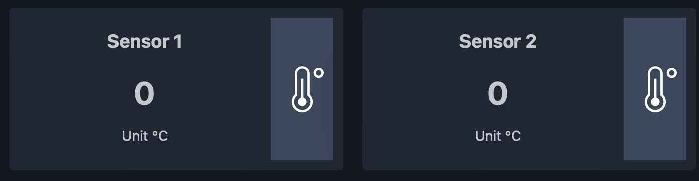

(Dashboard Elemente)

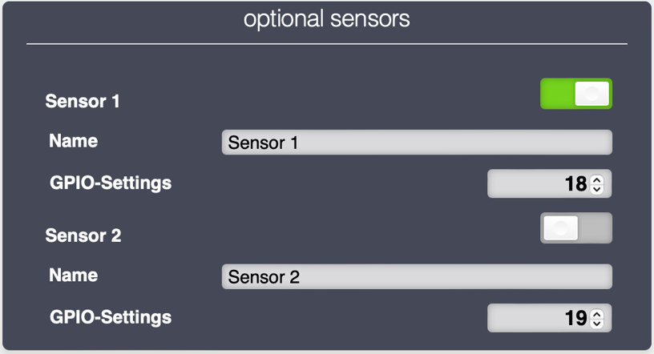

(Einstellugen)

> [!NOTE] 
> Dies ist jedoch nur optional und kann zusätzlich zu den Informationen, die die Software aus der Logamatic liest, verwendet werden.

## Optional: Abgas Sensor

Es ist auch möglich, einen optionalen Abgassensor (NTC 100K) an den Anschluss J5 der Platine anzuschließen. In einigen Fällen müssen einige fehlende Komponenten auf der Platine ergänzt werden.


| Komponente | Wert        |
|-----------|--------------|
| D5        | BZX84C5V1    |
| R17       | 3.3K         |
| R11       | 100K         |
| C11       | 100nF        |
| C12       | 33nF         |
| R35       | 0            |
| R39       | 0            |
 
Es besteht keine Notwendigkeit, den Sensor in der Software zu konfigurieren. Die Logamatic selbst erkennt den Sensor automatisch und sendet den Wert wie die anderen Werte.


-----

# Erste Schritte

## Platform-IO

Die Software wurde mit [Visual Studio Code] (https://code.visualstudio.com) und dem [PlatformIO-Plugin] (https://platformio.org) erstellt.  
Nach der Installation der Software kannst du das Projekt von GitHub klonen oder als zip herunterladen und in PlatformIO öffnen.
Dann noch den `upload_port` und die entsprechenden Einstellungen in `platformio.ini` an deinen USB-zu-Seriell-Adapter anpassen den Code auf den ESP hochladen.

> [!NOTE]
> Python muss ebenfalls installiert sein, um das Projekt vollständig zu kompilieren. Der Ordner scripts enthält beispielsweise Skripte für die Erstellung der Webseiten, die beim Kompilieren des Projekts aufgerufen werden.

## ESP-Flash-Tool

In den Veröffentlichungen (Releases) befinden sich auch die Binärdatei der Software. Wenn du PlatformIO nicht verwenden willst, kannst du auch die Datei `buderus_km271_esp32_flash_vx.x.x.bin` verwenden und direkt auf den ESP flashen. Diese bin-Datei ist bereits ein Fertig mit bootloader.bin, partitions.bin und der application.bin. Du kannst dieses Image auf den ESP an Adresse 0x00 flashen.  

**Windows**  
Es gibt verschiedene Tools, um Binärdateien auf den ESP zu übertragen.  
Eines davon ist [espressif-flash-download-tool](https://www.espressif.com/en/support/download/other-tools)

**macOS/Linux**  
Für Mac ist es schwierig, ein Tool mit einer grafischen Benutzeroberfläche zu finden, aber es kann einfach das esptool.py verwendet werden:

1. Terminal öffnen
2. esptool installieren: `pip install esptool`  
3. optional den Installationspfad abfragen: `welches esptool.py`  
4. Pfad setzen: `export PATH=„$PATH:/<Pfad>/esptool.py“` (<- ändere <Pfad> mit Ergebnis aus 3.)
5. Gehe zu dem Pfad, in dem sich die bin-Datei befindet
6. Device String abfragen: `ls /dev/tty* | grep usb` (verwende dies im nächsten Schritt für <UPLOAD-PORT>)
7. Upload: `esptool.py -p <UPLOAD-PORT> write_flash 0x00 buderus_km271_esp32_flash_vx.x.x.bin`  

## OTA-Updates

### lokales Web OTA-Update

Eine Möglichkeit ist, die OTA-Update-Datei von der neuesten Version auf GitHub herunterzuladen.
Nachdem man diese auf seinen Computer heruntergeladen hat, kann man ein Update mit dem eingebetteten WebUI OTA-Update durchführen.
Die Update Funktion befindet sich auf der Registerkarte „Tools“ der WebUI.

Hier kannst du einfach die Datei `buderus_km271_ota_update_vx.x.x.bin` aus dem Release-Bereich auswählen und das Update starten.

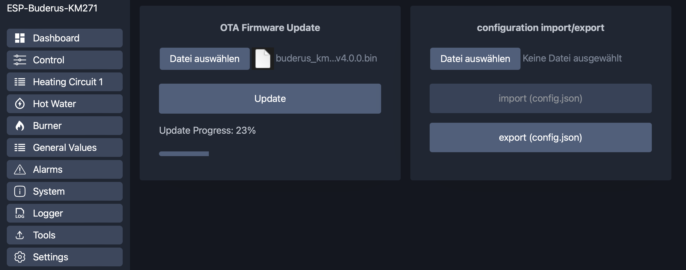

### GitHub OTA-Update

Seit Version 1.4.0 ist es auch möglich, den Controller direkt in der WebUI zu aktualisieren, ohne vorher die .bin-Datei herunterzuladen.
Wenn man auf die Versionsinfo unten links klickt, öffnet sich ein Dialog. Wenn eine neue Version verfügbar ist, kann man das Update hier direkt anstoßen. Es wird dann automatisch die neueste Version von github heruntergeladen und installiert!

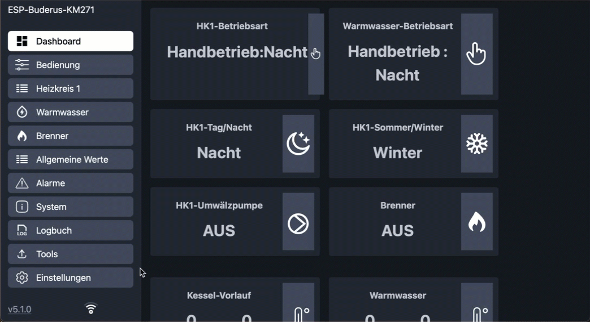

### PlatformIO OTA-Update

Aber es ist auch möglich, die Software drahtlos mit Platformio herunterzuladen.
Du musst nur die `upload_port` Einstellungen in der `platformio.ini` ändern.

Es gibt zwei vordefinierte Optionen:

- OPTION 1: direct cable upload
- OPTION 2: wireless OTA Update

## Setup Mode

Es gibt einen „Setup Mode“. Der „Setup Mode“ wird aktiviert, wenn der „Reset-Knopf“ des ESP zweimal innerhalb von 3 Sekunden gedrückt wird.
Der „Setup Mode“ wird auch aktiviert, wenn (zu Beginn) keine WLAN-Verbindung konfiguriert ist.

Wenn der ESP in den „Setup Mode“ geht, erstellt er automatisch einen eigenen Netzwerk Accesspoint mit der ssid  
📶 `"ESP-Buderus-KM271"`  
Nachdem du mit diesem Netzwerk verbunden bist, kannst du die WebUI übernachfolgende Adresse öffnen  
**"http://192.168.4.1"**

## Konfiguration

Hier können alle Konfigurationen vorgenommen werden, die zu der Heizungsanlage und der Infrastruktur passen.

- **WiFi**  
Gib im Feld „WiFi“ deine WLAN Anmeldedaten ein, um den ESP mit Ihrem Netzwerk zu verbinden.

- **Ethernet W5500**  
Verwende optional die Ethernet-Verbindung auf Basis des W5500, um den ESP mit dem Netzwerk zu verbinden.

- **Authentifizierung**  
Hier kann optional die Authentifizierungsfunktion aktiviert werden und Benutzer und Passwort konfiguriert werden.

- **NTP-Server**  
Der ESP kann sich mit einem NTP-Server verbinden, um die richtigen Zeitinformationen zu erhalten.
Die voreingestellte Zeitzone sollte passen, wenn du dich in Deutschland befindest. Andernfalls können diese manuell geändert werden.

- **Datum und Uhrzeit**  
Hier kannst du ein neues Datum und eine neue Uhrzeit in das Logamatic Heizsystem schreiben. (manuell oder aktuelle NTP-Server Zeit)

- **MQTT**  
hier können Sie die MQTT-Kommunikation aktivieren und obligatorische Parameter eingeben.  

- **Pushover**  
Parameter für Pushover-Benachrichtigungen.  
(API-Token und User-Key)  
Man kann hier auch eine Testnachricht senden.

- **Logamatic**  
hier kannst du auswählen, welche Komponenten deiner Logamatic verwendet werden sollen.

- **GPIO**  
Hier kannst du die GPIOs deines ESP-Boards konfigurieren. Du kannst die Optionen in der Auswahlliste verwenden, um Standardwerte je nach ausgewähltem Boardtyp zu erhalten.

- **Ölzähler**  
hier kannst du den optionalen Hardware- oder virtuellen Ölzähler aktivieren.
Wenn du einen hardwarebasierten Ölzähler verwendest, müssen auch die entsprechenden gpio's konfiguriert werden.
Wenn du den Verbrauch auf Basis der Laufzeit berechnen willst, müssen Sie die zusätzlichen Berechnungsparameter konfigurieret werden.

- **optionale Sensoren**  
Aktivierung und Konfiguration des optionalen DS18B20 Senosrs

- **Simulation**  
Aktiviere den Simulationsmodus, um Logamatic-Werte zu Testzwecken zu generieren

- **Sprache**  
Es sind zwei Sprachen verfügbar. Wählen deine bevorzugte Sprache.

> [!NOTE]
> Alle Einstellungen werden automatisch gespeichert, wenn Änderungen vorgenommen werden.


## Filemanager

Es gibt es auch einen eingebauten Dateimanager zum Öffnen (anzeigen), Herunterladen (exportieren) und Hochladen (importieren) der Konfigurationsdatei.
Die Konfiguration wird in der Datei ``config.json`` gespeichert. Zur Sicherung und Wiederherstellung der Konfiguration kannst du diese Datei herunterladen und hochladen.


-----

# MQTT

> [!NOTE]
> Die Sprache für die mqtt-Themen lässt sich in den mqtt-Einstellungen unabhängig von der Sprache der WebUI einstellen.

## Konfig und Status Werte

Die Software verarbeitet verschiedene Arten von Werten:

### Konfig Werte (nur lesend)

das sind Konfigurationswerte aus der Logamatic. Die Werte werden beim Start oder bei Änderungen an der Logamatic gelesen. Die Nutzdaten der Werte sind Integer oder Float.

Konfig-Werte als einzelne Themen (siehe Liste in [param.txt](Doc/param.txt))

```text
Beispiel:
Topic: esp_heizung/config/HK1_Frost_ab
Payload:   -1.00 °C     (String)
```

### Status Walues (nur lesend)

diese Werte ändern sich meist während der Laufzeit und werden bei Änderung automatisch gesendet. Der Payload der Werte ist ein String.

Statuswerte als einzelne Themen (siehe Liste in [param.txt](Doc/param.txt))

```text
Beispiel:
Topic: esp_heizung/status/HK1_BW1_Automatik
Payload:   1    (integer)
```

### zusätzliche Informationen (nur lesen)

Statusinformationen über WiFi:

```text
Topic: esp_heizung/wifi = {  
    "status":"online",  
    "rssi":"-50",  
    "signal":"90",  
    "ip":"192.168.1.1",  
    "date-time":"01.01.2022 - 10:20:30"  
}
```

Debug Informationen:

```text
Topic: esp_heizung/info = {  
    "logmode":true,
    "send_cmd_busy":false,
    "date-time":"01.01.2022 - 10:20:30"  
}
```

### Alarm Meldungen (nur lesend)

hier bekommt man Informationen über die letzten 4 Fehler/Faults, die von der Logamatic registriert wurden. Der Payload der Werte ist ein String.

> [!NOTE]
>Eine vollständige Liste der unterstützten Werte befindet sich in der **[param.txt](Doc/param.txt)**

Die mqtt-Themen können auch durch Bearbeiten an die eigenen Bedürfnisse angepasst werden: **[language.h](include/language.h)**

## Kommandos

Um die Werte der Logamatic zu ändern, können verschiedene `setvalue` Befehle aus der folgenden Liste verwendet werden.
Ein komplettes Topic könnte sein: `esp_heizung/setvalue/setdatetime`

**Man kann die Logamatic mit Befehlen wie diesen steuern:**

```text
command:    Neustart ESP
topic:      {cmd/restart", cmd/restart"}
payload:    nichts

command:    Serviceschnittstelle - nur für Experten - Benutzung auf eigene Gefahr!!!
topic:      {cmd/service", cmd/service"}
payload:    8 Hex-Werte, getrennt durch "_" (Beispiel: 08_15_04_65_65_65_65_65)

command:    Debug Funktion - on/off
topic:      {cmd/debug", cmd/debug"}
payload:    0/1

command:    Debug Funktion - set Filter
topic:      {cmd/setdebugflt", cmd/setdebugflt"}
payload:    11 Hex-Werte, getrennt durch "_" (example: 08_15_XX_XX_XX_XX_XX_XX_XX_XX_XX)

command:    Debug Funktion - get Filter
topic:      {cmd/getdebugflt", cmd/getdebugflt"}
payload:    nichts (return value at message topic)

command:    Setze Datung&Uhrzeit der Logamatic
topic:      {"setvalue/setdatetime", setvalue/setdatetime"}
payload:    nichts

command:    Setzte Ölzählerwert
topic:      {"setvalue/oilcounter", setvalue/oilcounter"}
payload:    Zählwert einschließlich 2 Dezimalstellen  (123,45L = 1234) 

command:    Heizkreis 1: Betriebsart 
topic:      {"setvalue/hk1_betriebsart", setvalue/hc1_operation_mode"}
payload:    0=night / 1=day / 2=auto  

command:    Heizkreis 2: Betriebsart 
topic:      {"setvalue/hk2_betriebsart", setvalue/hc2_operation_mode"}
payload:    (0=night / 1=day / 2=auto)

command:    Heizkreis 1: Programm 
topic:      {"setvalue/hk1_programm", setvalue/hc1_program"}
payload:    (0=custom / 1=family / 2=early / 3=late / 4=AM / 5=PM / 6=noon / 7=single / 8=senior)

command:    Heizkreis 2: Programm 
topic:      {"setvalue/hk2_programm", setvalue/hc2_program"}
payload:    (0=custom / 1=family / 2=early / 3=late / 4=AM / 5=PM / 6=noon / 7=single / 8=senior)

command:    Heizkreis 1: Auslegungstemperatur für Heizkurven
topic:      {"setvalue/hk1_auslegung", setvalue/hc1_interpretation"}
payload:    Resolution: 1 [°C] - Range: 30 ... 90 [°C]

command:    Heizkreis 2: Auslegungstemperatur für Heizkurven
topic:      {"setvalue/hk2_auslegung", setvalue/hc2_interpretation"}
payload:    Resolution: 1 [°C] - Range: 30 ... 90 [°C]

command:    Heizkreis 1: Einschalttemperatur
topic:      {"setvalue/hk1_aufschalttemperatur", setvalue/hc1_switch_on_temperature"}
payload:    Resolution: 1 [°C] - Range: 0 ... +10 [°C]

command:    Heizkreis 2: Einschalttemperatur
topic:      {"setvalue/hk1_aufschalttemperatur", setvalue/hc1_switch_on_temperature"}
payload:    Resolution: 1 [°C] - Range: 0 ... +10 [°C]

command:    Heizkreis 1: Abschaltschwelle für Absenkbetrieb
topic:      {"setvalue/hk1_aussenhalt_ab", setvalue/hc1_switch_off_threshold"}
payload:    Resolution: 1 [°C] - Range: -20 ... +10 [°C]

command:    Heizkreis 2: Abschaltschwelle für Absenkbetrieb
topic:      {"setvalue/hk2_aussenhalt_ab", setvalue/hc2_switch_off_threshold"}
payload:    Resolution: 1 [°C] - Range: -20 ... +10 [°C]

command:    Heizkreis 1: Sollwert der Tagestemperatur
topic:      {"setvalue/hk1_tagtemperatur", "setvalue/hc1_day_temp"}
payload:    Resolution: 0.5 [°C] - Range: 10 .. 30 [°C] 

command:    Heizkreis 2: Sollwert der Tagestemperatur
topic:      {"setvalue/hk2_tagtemperatur", "setvalue/hc2_day_temp"}
payload:    Resolution: 0.5 [°C] - Range: 10 .. 30 [°C] 

command:    Heizkreis 1: Nachttemperatur-Sollwert
topic:      {"setvalue/hk1_nachttemperatur", setvalue/hc1_night_temp"}
payload:    Resolution: 0.5 [°C] - Range: 10 .. 30 [°C] 

command:    Heizkreis 2: Nachttemperatur-Sollwert
topic:      {"setvalue/hk2_nachttemperatur", setvalue/hc2_night_temp"}
payload:    Resolution: 0.5 [°C] - Range: 10 .. 30 [°C] 

command:    Heizkreis 1: Urlaubstemperatur-Sollwert
topic:      {"setvalue/hk1_urlaubtemperatur", setvalue/hc1_holiday_temp"}
payload:    Resolution: 0.5 [°C] - Range: 10 .. 30 [°C] 

command:    Heizkreis 2: Urlaubstemperatur-Sollwert
topic:      {"setvalue/hk2_urlaubtemperatur", setvalue/hc2_holiday_temp"}
payload:    Resolution: 0.5 [°C] - Range: 10 .. 30 [°C] 

command:    Warmwasser: Betriebsart
topic:      {"setvalue/ww_betriebsart", setvalue/ww_operation_mode"}
payload:    0=night / 1=day / 2=auto

command:    Heizkreis 1: Sommerbetrieb Schwellenwert Temperatur
topic:      {"setvalue/hk1_sommer_ab", setvalue/hc1_summer_mode_threshold"}
payload:    Resolution: 1 [°C] - Range: 9:Summer | 10°..30° | 31:Winter

command:    Heizkreis 2: Sommerbetrieb Schwellenwert Temperatur
topic:      {"setvalue/hk2_sommer_ab", setvalue/hc2_summer_mode_threshold"}
payload:    Resolution: 1 [°C] - Range: 9:Summer | 10°..30° | 31:Winter

command:    Heizkreis 1: Schwellenwert für Frostbetrieb Temperatur
topic:      {"setvalue/HK1_Frost_ab", "setvalue/hc1_frost_protection_threshold"}
payload:    Resolution: 1 [°C] - Range: -20 ... +10 [°C]

command:    Heizkreis 2: Schwellenwert für Frostbetrieb Temperatur
topic:      {"setvalue/HK2_Frost_ab", "setvalue/hc2_frost_protection_threshold"}
payload:    Resolution: 1 [°C] - Range: -20 ... +10 [°C]

command:    Warmwasser: Solltemperatur
topic:      {"setvalue/ww_temperatur", setvalue/ww_temp"}
payload:    Resolution: 1 [°C] - Range: 30 ... 60 [°C]

command:    Heizkreis 1: Zählung der Tage für den Urlaubsmodus (Logamatic dekrementiert jeden Tag um eins)
topic:      {"setvalue/HK1_Ferien_Tage", "setvalue/hc1_holiday_days"}
payload:    count of days 0 .. 99

command:    Heizkreis 2: Zählung der Tage für den Urlaubsmodus (Logamatic dekrementiert jeden Tag um eins)
topic:      {"setvalue/HK2_Ferien_Tage", "setvalue/hc2_holiday_days"}
payload:    count of days 0 .. 99

command:    Warmwasserpumpenzyklen
topic:      {"setvalue/ww_zirkulation", setvalue/ww_circulation"}
payload:    Resolution: 1 [cycles/hour] - Range: 0:OFF | 1..6 | 7:ON

command:    Heizkreis 1: Reduzierbetrieb
topic:      {"setvalue/hk1_absenkungsart", setvalue/hc1_reduction_mode"}
payload:    Number 0..3 (Abschalt,Reduziert,Raumhalt,Aussenhalt) / {off,fixed,room,outdoors)

command:    Heizkreis 2: Reduzierbetrieb
topic:      {"setvalue/hk2_absenkungsart", setvalue/hc2_reduction_mode"}
payload:    Number 0..3 (Abschalt,Reduziert,Raumhalt,Aussenhalt) / {off,fixed,room,outdoors)

```

## Home Assistant

MQTT Discovery für Home Assistant macht es einfach, alle Werte in Home Assistant zu erhalten.
Die Logamatic wird automatisch als mqtt-Gerät im Home Assistant angezeigt.
Es werden die Konfigurationswerte und die Statuswerte angezeigt. Einige Konfigurationswerte können auch wie in der WebUI geändert werden.

siehe auch die offizielle Dokumentation: https://www.home-assistant.io/integrations/mqtt/#discovery-messages

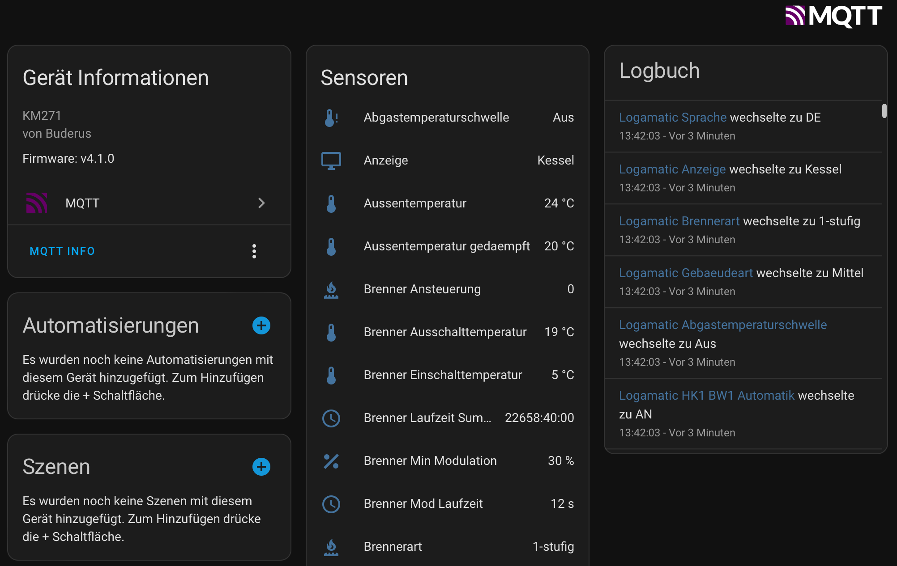 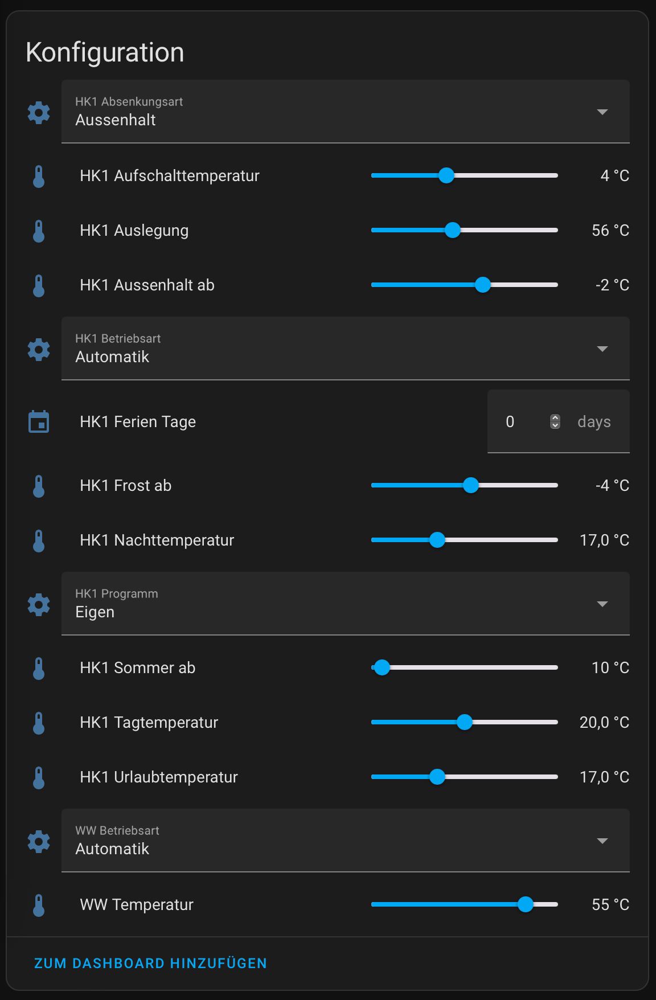

In den mqtt-Einstellungen kannst du die "Erkennungsfunktion" aktivieren und auch das mqtt-Topic und den Gerätenamen für Home Assistant festlegen  
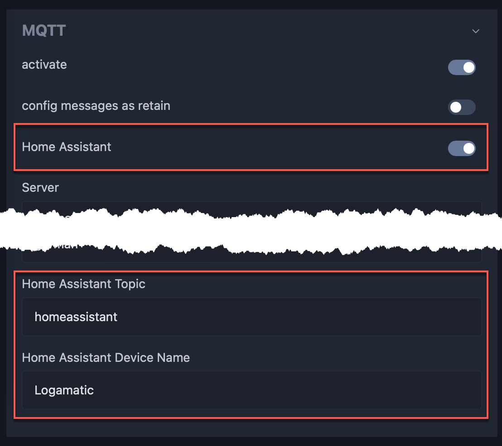

-----

# Optionale Kommunikation

Zusätzlich zu mqtt gibt es weitere Optionen zur Kommunikation.

## Pushover

Es gibt eine benutzerdefinierte Benachrichtigung als Pushover-Client.
Über den Parameter „Filter“ lässt sich festlegen, welche Art von Nachrichten man erhalten möchte.
In den Einstellungen befinden sich alle notwendigen Parameter, um den Client einzurichten.

Jede Anwendung, jeder Dienst oder jedes Dienstprogramm, das Benachrichtigungen über die API von Pushover sendet, muss über ein eigenes API-Token verfügen, das alle von ihm gestellten API-Anfragen eindeutig identifiziert.
API-Tokens sind kostenlos und können hier registriert werden [Pushover website](https://pushover.net/apps/build).

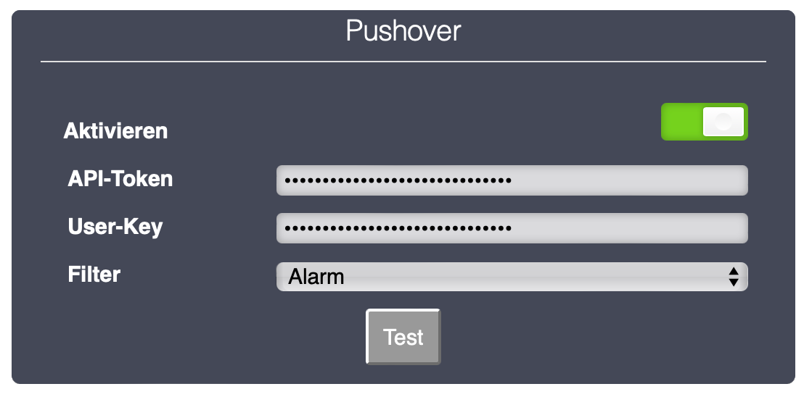

## WebUI-Logger

Außerdem gibt es eine Log-Funktion, mit der je nach Filter verschiedene Meldungen aufgezeichnet und über die WebUI angezeigt werden können. Dies kann für das eigene Debugging und auch für die Weiterentwicklung der Software nützlich sein.

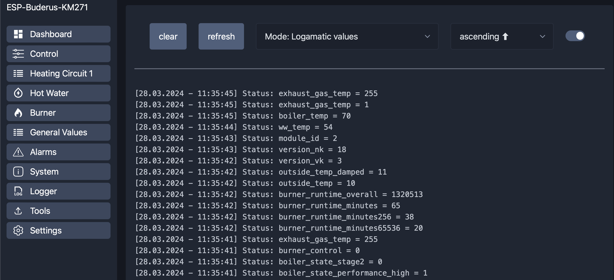

## Telnet

Neben der WebUI und MQTT gibt es auch eine Telnet-Schnittstelle zur Kommunikation mit dem ESP.
Die Schnittstelle bietet mehrere Befehle, um Informationen auszulesen und Befehle zu senden.
Eine Übersicht über die Befehle kann mit dem Befehl „help“ aufgerufen werden.
Zur Verbindung kann eine einfache Telnet-Verbindung über die entsprechende IP-Adresse des ESP gestartet werden.

Beispiel: 
```
> telnet 192.168.178.135
```

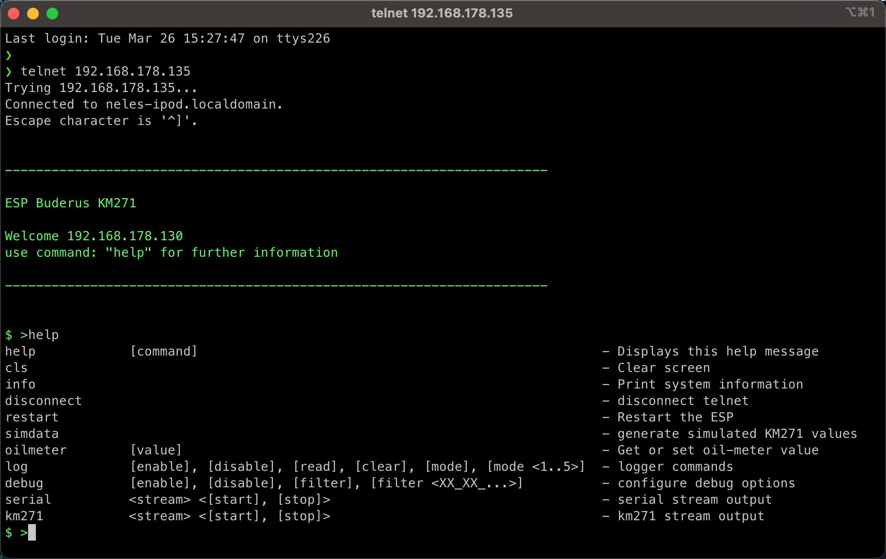

-----

# Optionale Komponenten

## node-red

Ich schreibe alle Informationen, die über MQTT übertragen werden, in eine influxDB Datenbank.  
In meinem Fall verwende ich [node-red](https://nodered.org/), um die MQTT-Nachrichten zu empfangen und sie in die [influxDB](https://www.influxdata.com/m) zu schreiben.  
Alles läuft in Docker auf meinem Synology NAS.  
Aber es gibt noch viele andere Möglichkeiten - verwende die, die am besten zu dir passt.


Wenn du an meinen Abläufen interessiert bist, kannst du diese Exportdatei verwenden:
[node-red.json](/Doc/node-red.json)

## grafana

Um die Informationen zu visualisieren, verwende ich [grafana](https://grafana.com), das die Daten aus der influxDB bezieht.  
Für mich bietet dies mehr Möglichkeiten, das Verhalten des Heizungssystems zu analysieren, als ein statisches Dashboard.  

Hier sind einige Eindrücke davon, was ich mit den Informationen aus der Logamatic gemacht habe:


Wenn Sie an meinem Dashboard interessiert sind, können Sie diese Exportdatei verwenden:
[grafana.json](/Doc/grafana.json)

> [!NOTE]
> Es basiert auf InfluxDB 2.0 mit der Abfragesprache „Flux“ und verwendet die deutschen mqtt topics! Wenn du dein System auf die gleiche Weise einrichtest, sollte es mehr oder weniger eine Plug-and-Play-Lösung sein, meine grafana.json zu importieren

# FAQ

## Keine Verbindung zur Logamatic / Keine Werte von der Logamatic

1) prüfe die GPIO Einstellung für dein Setup. Bei verwendung der Boards von the78mole muss mindestens folgendes eingestellt sein:
`KM271-RX = 4` und `KM271-2X = 2`

2) prüfe ob der Widerstand zwischen Pin 4 und Pin 8 an der Stiftleiste wo das Board eingesteckt wird, ca. 10kOhm beträgt.
Dieser Widerstand ist wichtig, damit die Logamatic das Board erkennt.

## ESP startet automatisch neu

1) WiFi Verbindung ist instabil
Wenn das Board nicht zusätzlich auch über Ethernet verbunden ist, dann ist eine WiFi Verbindung essentiell. Daher wird bei einem Verbindungsabbruch automatisch 5 mal in einem Intervall von 30 Sekunden versucht die Verbindung wieder aufzubauen. Gelingt dies nicht, startet der ESP neu und versucht es erneut.
Im WebUI auf der Seite "System" ist der Grund für den letzten Neustart eingetragen.

2) MQTT aktiviert aber keine Verbindung möglich
Wenn MQTT aktiviert ist, es aber zu einem Verbindungsabbruch kommt, wird automatisch 5 mal versucht die Verbindung wieder aufzubauen (Intervall 10s, 20s, 30s, 40s, 50s). Gelingt dies nicht, startet der ESP neu und versucht es erneut.
Im WebUI auf der Seite "System" ist der Grund für den letzten Neustart eingetragen.

## Verwendung mit ioBroker

Hier ist zu beachten, dass es unterscheidliche Topics für das lesen und schreiben von Werten gibt. Beim Start des ESP sendet die Logamatic automatisch alle Config und Status Werte und diese werden dann auch per MQTT gesendet. Dies sind aber alles lesende Werte die nicht über das gleiche Topic geschrieben werden können.
Die Topics zum Schreiben lauten immer ../setvalue/..  
Mögliche Kommandos stehen z.B. hier: [Kommandos](#commands)

Zusätzlich sollte man im ioBroker folgende Einstellungen deaktivieren:

- "States bei subscribe publizieren"
- "Eigene States beim Verbinden publizieren"

## OTA Firmware Update ist fehlgeschlagen

Es passiert leider öfters mal, dass ein OTA Update über das WebUI nicht erfolgreich ist. Die Gründe dafür sind mir leider nicht bekannt.
Meisten klappt es dann aber nach ein paar weiteren Versuchen.
Wenn ihr das Board über WiFi und über Ethernet verbunden habt, dann auch mal über beide Verbindungen testen. Manchmal klappt es über die eine Verbindung nicht, über die andere dann sofort.

-----

# ❗️ Benutzung auf eigene Gefahr ❗️

**Fühl dich frei, es zu benutzen und an deine Bedürfnisse anzupassen!**

**Wenn du etwas zu verbessern hast, lass uns alle von deinen Ideen wissen!**

❓ Wenn du eine Frage hast, benutze die [Discussions](https://github.com/dewenni/ESP_Buderus_KM271/discussions)  
🐞 Wenn es ein Problem oder einen Fehler gibt, benutze die [Issues](https://github.com/dewenni/ESP_Buderus_KM271/issues)
