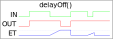

# muTimer Library #

## About this Library ##
This library provides a non-blocking timer/delay/cycle functionality for Arduinos and it consumes not very much RAM.

It does not use any hardware timers, it uses the Arduino millis() and micros() functions to store the start time. It probably runs on other platforms as well, if you replace these functions with any other functions that return milliseconds and microseconds as uint32_t value.\

You can find the source there: https://github.com/MichaelUray/muTimer/ \
MIT license, check LICENSE file for more details.


## Introduction ##

There is often the requirement in a program to wait for a certain time before an action gets taken.

These library functions can get used for example to do any action if an input is true for at least for a given time period.

You should look on [delayOn()](#delayon) and [delayOff()](#delayoff) for normal on/off delays, as well as on [cycleOnOff()](#cycle-onoff) and [cycleOnOffTrigger()](#cycleonofftrigger) for periodically cycles if you quickly want to understand how the most important functions of this library work.





## Index ##
- [muTimer Library](#mutimer-library)
  * [About this Library](#about-this-library)
  * [Introduction](#introduction)
  * [Index](#index)
  * [Application Examples](#application-examples)
    + [delayOnOff() / delayOn() / delayOff()](#delayonoff--delayon--delayoff)
    + [delayOnTrigger()](#delayOnTrigger)
    + [cycleOnOff()](#cycleOnOff)
    + [cycleTrigger()](#cycleTrigger)
  * [Comparision to manually programmed timing solutions](#comparision-to-manually-programmed-timing-solutions)
    + [delay ()](#delay)
    + [millis()](#millis)
    + [Interrupt Safe](#interrupt-safe)
    + [Overflow Safe](#overflow-safe)
- [Functions](#functions)
  * [Delay On/Off](#delay-onoff)
    + [delayOnOff()](#delayonoff)
    + [delayOn()](#delayon)
    + [delayOff()](#delayoff)
  * [Delay On/Off Trigger](#delay-onoff-trigger)
    + [delayOnOffTrigger()](#delayonofftrigger)
    + [delayOnTrigger()](#delayontrigger-1)
    + [delayOffTrigger()](#delayofftrigger)
  * [Delay Control](#delay-control)
    + [delayReset()](#delayreset)
    + [delayElapse()](#delayelapse)
  * [Delay Information](#delay-information)
    + [delayIsRunning()](#delayisrunning)
  * [Cycle On/Off](#cycle-onoff)
    + [cycleOnOff()](#cycleonoff-1)
  * [Cycle Trigger](#cycle-trigger)
    + [cycleOnOffTrigger()](#cycleonofftrigger)
    + [cycleTrigger()](#cycletrigger-1)
  * [Cycle Control](#cycle-control)
    + [cycleResetToOff()](#cycleresettooff)
    + [cycleResetToOn()](#cycleresettoon)
  * [General Information](#general-information)
    + [getTimeElapsed()](#gettimeelapsed)
  * [Configuration](#configuration)
    + [setTimeBaseToMs()](#settimebasetoms)
    + [setTimeBaseToUs()](#settimebasetous)
- [Example](#example)
- [Forum Discussions](#forum-discussions)


## Application Examples ##

Some application examples for which this library could work for.
### delayOnOff() / delayOn() / delayOff() ###
- Debounce a switch or button.
- Switch a pump on by a floating switch if the input is true for at least 1 minute. Turn the pump off, if the switch input gets false for at least 15 seconds. Prevents that the pump turns on and off to often.
- Take any action after a given time permanently, e.g. switch an LED on 5s after the input gets true.
- Any other application where a delayed input or output is required.

### delayOnTrigger() ###
- Take any action after a given time just once, if an input gets true. e.g. send a string via the serial interface once 5s after input became true.

### cycleOnOff() ###
- Create LED flashing with given on/off interval times.
- Any other applications where a periodic on/off signal is required.

### cycleTrigger() ###
- send a string via the serial interface every 5s.
- Take any other action repeatedly by a given time interval.


## Comparision to manually programmed timing solutions ##

### delay() ###
The easiest way to create a delay in a program is probably the function delay(), but with the disadvantage that nothing else can happen in the meanwhile. Means the delay() function is blocking other code executions while it is waiting.

```cpp
// processor pin definitions
#define PIN_LED 9

// LED1 status variable
bool LED1;

void setup()
{
  // put your setup code here, to run once:

  // configure output hardware pin
  pinMode(PIN_LED, OUTPUT);
}

void loop()
{
  // put your main code here, to run repeatedly:
  
  LED1 = 0;
  digitalWrite(PIN_LED, LED1);
  delay(500);
  LED1 = 1;
  digitalWrite(PIN_LED, LED1);
  delay(100);
}
```
While the LED is off or on in this example and the delay(500) or delay(100) is waiting for its time to elapse, nothing else can happen (except of interrupts).

The following example shows how a flashing LED can get implemented without blocking other code.
```cpp
#include <muTimer.h>

// processor pin definitions
#define PIN_LED 9

// LED1 status variable
bool LED1;

// muTimer object
muTimer myTimer1 = muTimer();

void setup()
{
  // put your setup code here, to run once:

  // configure output hardware pin
  pinMode(PIN_LED, OUTPUT);
}

void loop()
{
  // put your main code here, to run repeatedly:

  // LED flashing with 500ms off and 100ms on
  LED1 = myTimer1.delayOnOff(!LED1, 500, 100);
  digitalWrite(PIN_LED, LED1);
}
```
The accuracy of the time interval in this example depends on that how often the delayOnOff() function gets called, since the next time measurement starts everytime after a call.

A better way to create an accurate on/off cycle would be to use the cycleOnOff() function since it internally makes sure that the time intervall stays the same.
```cpp
#include <muTimer.h>

// processor pin definitions
#define PIN_LED 9

// LED1 status variable
bool LED1;

// muTimer object
muTimer myTimer1 = muTimer();

void setup()
{
  // put your setup code here, to run once:

  // configure output hardware pin
  pinMode(PIN_LED, OUTPUT);
}

void loop()
{
  // put your main code here, to run repeatedly:

  // LED flashing with 100ms on and 500ms off
  LED1 = myTimer1.cycleOnOff(100, 500);

  // write LED1 status to hardware output
  digitalWrite(PIN_LED, LED1);
}
```


### millis() ###

Another typical example would be to store the current time in msec if something happens and to subtract it then from the current time later to check if a certain interval elapsed.
```cpp
// processor pin definitions
#define PIN_BUTTON 3
#define PIN_LED 9

// button status read from input pin
bool button1;

// LED1 status variable
bool LED1;

// store time when button got pressed
uint32_t timeWhenButtonPressed;

void setup()
{
  // put your setup code here, to run once:

  // configure input hardware pin with internal pull-up resistor, button has to switch against GND
  pinMode(PIN_BUTTON, INPUT_PULLUP);

  // configure output hardware pin
  pinMode(PIN_LED, OUTPUT);
}

void loop()
{
  // put your main code here, to run repeatedly:

  // read input (button) from hardware (input is inverted since internal pull-up resistor gets used)
  button1 = !digitalRead(PIN_BUTTON);

  // store time if button gets pressed
  if (button1)
  {
    timeWhenButtonPressed = millis();
  }

  // check if time deviation since button press is greater than 2000ms
  if (millis() - timeWhenButtonPressed >= 2000)
  {
    LED1 = 1;
  }
  else
  {
    LED1 = 0;
  }

  // write LED1 status to hardware output
  digitalWrite(PIN_LED, LED1);
}
```
There is a problem in this example which occurs if button1 stays true for longer as the uint32_t range in msec (~49 days) minus the interval, the condition would get then false again, even if this probably happens not often in the most of the applications.

The muTimer library does not have this problem since it only gets active if (output != input). If the time is already elapsed it does not care anymore about the time difference.

This is how the same example looks with the muTimer library:
```cpp
#include <muTimer.h>

// processor pin definitions
#define PIN_BUTTON 3
#define PIN_LED 9

// button status read from input pin
bool button1;

// LED1 status variable
bool LED1;

// muTimer object
muTimer myTimer1 = muTimer();

void setup()
{
  // put your setup code here, to run once:

  // configure input hardware pin with internal pull-up resistor, button has to switch against GND
  pinMode(PIN_BUTTON, INPUT_PULLUP);

  // configure output hardware pin
  pinMode(PIN_LED, OUTPUT);
}

void loop()
{
  // put your main code here, to run repeatedly:

  // read input (button) from hardware (input is inverted since internal pull-up resistor gets used)
  button1 = !digitalRead(PIN_BUTTON);

  // store time if button gets pressed
  if (button1)
  {
    myTimer1.delayReset();
  }

  // check if time deviation since button press is greater as 2000ms
  if (myTimer1.delayOn(1, 2000))
  {
    LED1 = 1;
  }
  else
  {
    LED1 = 0;
  }

  // write LED1 status to hardware output
  digitalWrite(PIN_LED, LED1);
}
```

Since the digitalWrite() consumes some processor cycles to get executet, a more performant way would be to call digitalWrite() only if a change happened.
```cpp
#include <muTimer.h>

// processor pin definitions
#define PIN_LED 9

// muTimer object
muTimer myCycle1 = muTimer();

void setup()
{
  // configure output hardware pin
  pinMode(PIN_LED, OUTPUT);
}

void loop()
{
  // LED flashing with 100ms on and 500ms off
  switch (myCycle1.cycleOnOffTrigger(100, 500))
  {
    // state changed from 1->0
    // turn LED off
    case 0:
      digitalWrite(PIN_LED, LOW);
    break;

    // state changed from 0->1
    // turn LED on
    case 1:
      digitalWrite(PIN_LED, HIGH);
    break;

    // no state change, timer is running
    case 2:
    break;
  }
}

// out: _____-_____-_____-_____-_____
```

### Interrupt Safe ###
Another disadvantage from the delay() function is, that you cannot use it within interrupts. This is because the time gets generated by the timer0 interrupt, which does not work as long as you are in another interrupt routine.

### Overflow Safe ###
Users often run into an [int32_t overflow issue](https://www.norwegiancreations.com/2018/10/arduino-tutorial-avoiding-the-overflow-issue-when-using-millis-and-micros/) when they create their own programm with the millis() or micros() functions.\
To handle the uint32_t overflow accordingly is also considered by this library.
There is a [test program](https://github.com/MichaelUray/muTimer/tree/main/examples/SerialMsecOverflowSafeTest) in the example folder which proves the overflow safety.

# Functions #

## Delay On/Off ##

### delayOnOff() ##
On and off delay.\
Combines delayOn() and delayOff() in one function.\
Starts the delay if the bool 'input' gets set and it returns true when the 'on' time given by 'delayTimeSwitchOn' in msec is elapsed.\
If the output is already set and you clear the 'input', then it starts the 'off' delay and it returns false when the time given by 'delayOfTime' in msec is elapsed.
```cpp
bool delayOnOff(bool input, uint32_t delayTimeSwitchOn, uint32_t delayTimeSwitchOff);

// example: on delay 4000ms, off delay 2000ms
output1 = myTimer1.delayOnOff(input1, 4000, 2000);

// in : _______------------______---______________------------_------
// out: ___________----------_________________________---------------
```

### delayOn() ###
On delay only.\
Same as delayOnOff(), but on delay only.\
It works similar to the ton() function from the IEC-Timers which are well known in the PLC programming world, or like a regular time delay relay with on delay.
<br>


```cpp
bool delayOn(bool input, uint32_t delayTimeSwitchOn);
  
// example: on delay 4000ms
output1 = myTimer1.delayOn(input1, 4000);

// in : _______------------____________---______
// out: ___________--------_____________________
```

### delayOff() ###
Off delay only.\
Same as delayOnOff(), but off delay only.\
It works similar to the tof() function from the IEC-Timers which are well known in the PLC programming world, or like a regular time delay relay with off delay.
<br>


```cpp
bool delayOff(bool input, uint32_t delayTimeSwitchOff);

// example: off delay 2000ms
output1 = myTimer1.delayOff(input1, 2000);

// in : _______------------_______
// out: _______--------------_____
```


## Delay On/Off Trigger ##

### delayOnOffTrigger() ###
On and off delay with output trigger.\
Delay on and off trigger.\
Sets the output to 0 once if the delayOffTime elapsed and if the output of delayOnOff() would go to 0.\
Sets the output to 1 once if the delayOnTime elapsed and if the output of delayOnOff() would go to 1.\
Sets the output to 2 if the time between cycles is running.
```cpp
byte delayOnOffTrigger(bool input, uint32_t delayTimeSwitchOff);

// example: on delay 4000ms, off delay 2000ms
switch (myTimer1.delayOnOffTrigger(input1, 4000, 2000))
{ 
  // delay time elapsed, output = off now, gets executed just once
  case 0:
    Serial.println("Delay off finished: output == 0");
  break;
  
  // delay time elapsed, output = on now, gets executed just once
  case 1:
    Serial.println("Delay on finished: output == 1");
  break;
  
  // delay is running
  case 2:
    // ...
  break;
}

// in : _______------------_________
// out: ___________1_________0______  (all "_" = 2)
// out: 2222222222212222222220222222  (it actually looks like this)
```
### delayOnTrigger() ###
On delay only with output trigger.\
The output gets just true once if the delay time elapses.
```cpp
bool delayOnTrigger(bool input, uint32_t delayTimeSwitchOff);

// example: on delay 4000ms
if (myTimer1.delayOnTrigger(input1, 4000))
{ // timer elapsed - gets executed just once
  Serial.println("Timer on finished: input1 == 1");
}

// in : _______------------__________
// out: ___________-_________________
```

### delayOffTrigger() ###
Off delay only with output trigger.\
The output gets just true once if the delay time elapses.
```cpp
bool delayOffTrigger(bool input, uint32_t delayTimeSwitchOff);

// example: off delay 2000ms
if (myTimer1.delayOffTrigger(input1, 2000))
{ // timer elapsed - gets executed just once
  Serial.println("Timer on finished: input1 == 0");
}

// in : _______------------__________
// out: _____________________-_______
```


## Delay Control ##

### delayReset() ###
Restarts the time from 0 and sets output != input at the next delay function call.
```cpp
void delayReset(void);
```

### delayElapse() ###
Ends the current running delay interval and sets output == input at the next delay function call.
```cpp
void delayElapse(void);
```

## Delay Information ##

### delayIsRunning() ###
Returns true if delay is still running.
```cpp
bool delayIsRunning(void);
```

## Cycle On/Off ##

### cycleOnOff() ###
Sets the output between on and off by the given time intervals.
Could get used to create LED flashing or other intervals. To write only to the output on changes look at [cycleOnOffTrigger()](#cycleonofftrigger).
<br>


```cpp
bool cycleOnOff(uint32_t onTime, uint32_t offTime)

// example: LED on 2000ms, LED off 4000ms
LED1 = myTimer1.cycleOnOff(2000, 4000);

// out: ____--____--____--____--____
```


## Cycle Trigger ##

### cycleOnOffTrigger() ###
Sets the output to 0 once if the onTime elapsed and if the output of cycleOnOff() would go to 0.
Sets the output to 1 once if the offTime elapsed and if the output of cycleOnOff() would go to 1.
Sets the output to 2 if the time between cycles is running.
Could get used to run any action once if the cycle time is elapsed.
```cpp
byte cycleOnOffTrigger(uint32_t onTime, uint32_t offTime);

// example: on 2000ms, off 4000ms
switch myTimer1.cycleOnOffTrigger(2000, 4000);
{
  // gets executed after 2000ms once, then the 4000ms delay starts
  // change from 1 -> 0
  case 0:
    digitalWrite(PIN_LED, LOW);
  break;

  // gets executed after 4000ms once, then the 2000ms delay starts
  // change from 0 -> 1
  case 1:
    digitalWrite(PIN_LED, HIGH);
  break;
}

// OUT: 2222|1|22|0|2222|1|22|0|2222
```

### cycleTrigger() ###
Sets the output to 1 once if the time elapsed
Could get used to run any action once in a periodic interval.

Creates a periodic output trigger.
```cpp
// triggers the output periodically once by the given cycleTime
bool cycleTrigger(uint32_t cycleTime);

// cycle time 4000ms
if (myTimer1.cycle(4000))
{
  // gets called every 4000ms once
  myFunction1();  
}

//OUT: ____-____-____-____-____
```


## Cycle Control ##

### cycleResetToOff() ###
Sets the output to off and starts the cycle time from now.
Allows to synchronize cycle with other timings.
```cpp
// timer cycle reset to output off, allows to synchronize cycle with other timings
void cycleResetToOff(void);
```

### cycleResetToOn() ###
Sets the output to on and starts the cycle time from now.
Allows to synchronize cycle with other timings.
```cpp
// timer cycle reset to output on, allows to synchronize cycle with other timings
void cycleResetToOn(void);
```

## General Information ##

### getTimeElapsed() ###
Returns the elapsed time since the start of the delay.
```cpp
uint32_t getTimeElapsed(void);
```

## Configuration ##

### setTimeBaseToMs() ###
[default]\
Sets the time base of the timing functions to ms (milliseconds).\
All time functions use then ms.
```cpp
void setTimeBaseToMs(void);
```

### setTimeBaseToUs() ###
Sets the time base of the timing functions to us (microseconds).\
All time functions use then us.
```cpp
void setTimeBaseToMs(void);
```


# Example #

```cpp
/*
 * Example ButtonDebounceDelayOnOffAndLedFlashingCycleOnOff.ino for muTimer library.
 * Library source: https://github.com/MichaelUray/muTimer
 * 
 * This example creates a blinking LED (100ms/500ms) if the input button gets pressed for at least 1s.
 * If the button gets released for at least 2s, then the blinking stops.
 * 
 * The library calls are non-blocking, means other code can get executed while the time duration is running.
 * 
 */

#include <muTimer.h>

muTimer mutButtonDebounce = muTimer();
muTimer mutLedFlashing = muTimer();

// processor pin definitions
#define PIN_BUTTON1 3
#define PIN_LED1 9

// pin status read from input
bool button1;

// output written to hardware output pin
bool led1;

void setup()
{
  // configure input hardware pin with internal pull-up resistor, button has to switch against GND
  pinMode(PIN_BUTTON1, INPUT_PULLUP);

  // configure output hardware pin
  pinMode(PIN_LED1, OUTPUT);
}

void loop()
{
  // read input (button) from hardware (input is inverted since internal pull-up resistor gets used)
  button1 = !digitalRead(PIN_BUTTON1);

  // starts blinking if input is true for at least 1000ms, stops blinking if input is false for at least 2000ms
  // in a normal debounce application whould that be just a few ms, these high values are just for this example that you can recognize the time delay.
  if (mutButtonDebounce.delayOnOff(button1, 1000, 2000))
  {
    // the LED is on for 100ms and then off for 500ms
    led1 = mutLedFlashing.cycleOnOff(100, 500);
  }
  else
  {
    led1 = 0;
  }
  
  // write output (LED) to hardware
  digitalWrite(PIN_LED1, led1);


  // functions are non-blocking
  // other code can get executed there in the meanwhile
  // ...
    
}
```

# Forum Discussions #

There are several places to discuss the library and its functions and/or issues.
- [Github Discussions](https://github.com/MichaelUray/muTimer/discussions)
- [Github Issues](https://github.com/MichaelUray/muTimer/issues)
- [Arduino Forum](https://forum.arduino.cc/index.php?topic=720536.msg4842211)
- [PlatformIO Forum](https://community.platformio.org/t/new-library-mutimer-on-off-delay-cycle-timer-non-blocking-for-arduino/18257)
